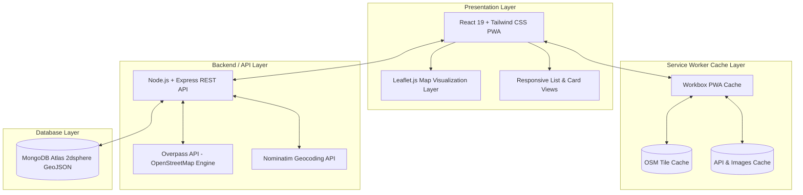

# ☕ CaféFinder Map — Open-Source Progressive Web App

[](https://www.gnu.org/licenses/gpl-3.0)
[](https://react.dev/)
[](https://leafletjs.com/)
[](https://www.openstreetmap.org/)
[](https://vite-pwa-org.netlify.app/)
[](https://nodejs.org/)
[](https://www.mongodb.com/atlas)

> **CaféFinder** is an open-source, mobile-first Progressive Web Application (PWA) built to help remote workers, students, and coffee enthusiasts discover cafes through an **interactive, geospatial OpenStreetMap layer** powered by **Leaflet.js**, eliminating reliance on expensive proprietary mapping APIs.

---

## 👥 Academic Context (ROSP / ROSPL)

* **Course**: Remote Open Source Project / Open Source Software Lab
* **Group No**: 4
* **Team Members**:
  * Devika Ghadi (Roll No. 32)
  * Tisha Gogia (Roll No. 34)
  * Tanvi Khadatkar (Roll No. 47)

---

## 📌 Problem Statement & Motivation

Finding suitable cafes in a particular neighborhood is often cumbersome when using non-visual list interfaces or proprietary mapping platforms. Commercial solutions (such as Google Maps Places API) present distinct challenges for student-led and community-driven initiatives:
* **Cost & Vendor Lock-In:** Strict quota thresholds and mandatory credit card billing.
* **Opaque Data Structures:** Closed APIs with non-reproducible ranking and search algorithms.
* **Lack of Study/Work-Focused Filters:** Generic platforms rarely capture developer and student-specific venue amenities such as reliable Wi-Fi, power sockets, outdoor seating, or takeaway options.

**CaféFinder** bridges this gap by marrying an entirely open-source geospatial stack (**OpenStreetMap + Leaflet.js**) with a high-performance **PWA** and crowdsourced amenity filtering.

---

## 🏛️ System Architecture

CaféFinder adheres to a modular 4-tier layered architecture:



### 1. Presentation Layer (`client/src/`)
* Built with **React 19**, **Tailwind CSS v4**, and **Framer Motion**.
* Responsive layout adapting across mobile, tablet, and desktop viewports.
* Toggle between **List View** (`/`) and **Interactive Map View** (`/map`).

### 2. Map Visualization Layer (`client/src/components/MapComponent.jsx`)
* Interactive mapping powered by **Leaflet.js**.
* Renders map tiles directly from **OpenStreetMap** (`https://tile.openstreetmap.org/{z}/{x}/{y}.png`).
* Plots cafes as custom SVG markers dynamically placed at geographic coordinates (`[latitude, longitude]`).
* Interactive popups with cafe thumbnail, live ratings, cuisine, address, details navigation, and OpenStreetMap turn-by-turn directions.
* Live user geolocation marker with pulsating radar animation.

### 3. Backend / API Layer (`server/server.js`)
* Built on **Node.js** and **Express.js**.
* Integrates with **Overpass API** to query OpenStreetMap nodes and ways (`amenity=cafe`).
* Uses **Nominatim API** for forward and reverse geocoding without proprietary API keys.
* RESTful endpoints for cafe discovery, location querying, user authentication, and deals.

### 4. Database Layer
* **MongoDB Atlas** storing cafe documents with GeoJSON `Point` coordinates.
* `2dsphere` spatial indexing for fast proximity and radius queries (`$near` queries within 5km).

---

## ✨ Key Features

* 🗺️ **Interactive OpenStreetMap Visualization:** Smooth pan, zoom, auto-fit bounding box, and interactive cafe pins.
* 📍 **Dual View Modes:** Seamlessly switch between the rich cafe card catalog and the geospatial map.
* 🔍 **Smart Proximity Discovery:** Use device GPS ("Use My Location") or search any city/neighborhood.
* 🏷️ **Domain-Specific Filtering:** Filter venues by:
  * Categories: *Coffee*, *Bakery*, *Brunch*
  * Study/Work Amenities: *Wi-Fi*, *Outdoor Seating*, *Takeaway*
* 📱 **Progressive Web App (PWA):**
  * Fully installable on iOS and Android home screens.
  * Workbox runtime caching for app assets, API responses, and OpenStreetMap map tiles.
* 🏷️ **Exclusive Deals & Redemptions:** Real-time discount codes and 3-minute timed voucher redemptions.
* 🛡️ **User Authentication & Favorites:** Secure account management and personalized saved cafes.

---

## 🚀 Getting Started

### Prerequisites
* [Node.js](https://nodejs.org/) (v18 or later recommended)
* [npm](https://www.npmjs.com/)
* [MongoDB Atlas](https://www.mongodb.com/atlas) connection URI

### 1. Clone the Repository
```bash
git clone https://github.com/tanvi-09112005/CafeFinder.git
cd CafeFinder
```

### 2. Configure Environment Variables

**Backend (`server/.env`):**
```env
MONGO_URI=your_mongodb_atlas_connection_string
PORT=5000
```

**Frontend (`client/.env.local`):**
```env
VITE_API_URL=http://localhost:5000
```

*(For production builds, set `VITE_API_URL` to your deployed backend URL on Render).*

### 3. Run the Backend Server
```bash
cd server
npm install
npm run dev
```
Backend will run at `http://localhost:5000`.

### 4. Run the Client Application
```bash
cd ../client
npm install
npm run dev
```
Client will run at `http://localhost:5173`.

---

## 📡 API Endpoints Summary

| Method | Endpoint | Description |
| :--- | :--- | :--- |
| `GET` | `/api/cafes?location={query}` | Geocodes query and returns nearby cafes with coordinates |
| `GET` | `/api/cafes/coordinates?lat={lat}&lon={lon}` | Returns cafes near geographic coordinates via MongoDB `$near` |
| `GET` | `/api/cafes/:id` | Returns complete details, menu, and reviews for a specific cafe |
| `POST` | `/api/auth/signup` | Registers a new user account |
| `POST` | `/api/auth/login` | Authenticates user credentials |
| `GET` | `/api/deals/nearby?lat={lat}&lon={lon}` | Returns proximity-scored discount deals |
| `POST` | `/api/deals/:id/redeem` | Claims a timed deal redemption |
| `POST` | `/api/favorites/toggle` | Toggles cafe in user's saved favorites list |

---

## 📄 Open Source Licensing & Attributions

### GNU General Public License v3.0 (GPL-3.0)
This project is licensed under the terms of the **GNU General Public License v3.0 (GPL-3.0)**. You are free to run, study, share, and modify this software in accordance with the copyleft provisions of GPLv3. See the full [LICENSE](./LICENSE) file for details.

### Third-Party Data & Component Attributions
* **Map Data**: [OpenStreetMap](https://www.openstreetmap.org/copyright) data is &copy; OpenStreetMap contributors, licensed under the [Open Database License (ODbL)](https://opendatacommons.org/licenses/odbl/).
* **Map Engine**: [Leaflet.js](https://leafletjs.com/) is licensed under the BSD 2-Clause License.
* **Geocoding & Amenity Extraction**: Powered by Nominatim and the OpenStreetMap Overpass API.